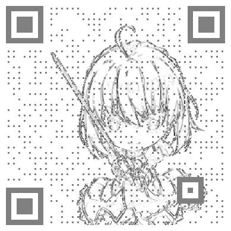

# customize_qrcode
A small customize generator for qr code

一个小型qr码自定义生成器

## 效果图

灰度差值

 

灰度差值+二值化

 

灰度差值+二值化+像素对齐

 

灰度

 

灰度+二值化

 

灰度+二值化+像素对齐

 

## 编译相关
编译环境: Visual Studio 2015

运行环境: .net Framework 4.0

选择`Release`生成即可

## 使用相关
1. 输入二维码内容
2. 选择必要的图片处理参数，点击`选图并生成`，选择一张图片（暂不支持gif）
3. 在二维码框内使用鼠标点击进行拖动，鼠标滚轮进行缩放
4. 调整好位置后点击`裁剪保存`，输入保存的文件名即可
